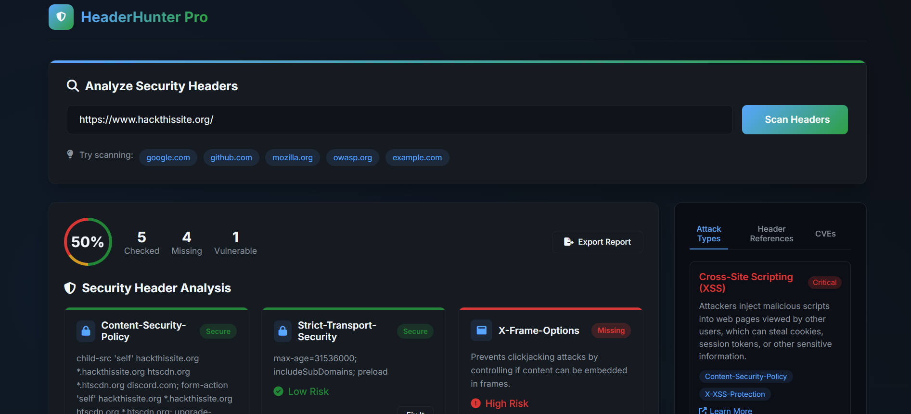

# 🛡️ HeaderHunter Pro

**Advanced Website Security Header Scanner**  
*Analyze. Understand. Secure.*

---

## 🔍 What is HeaderHunter?

**HeaderHunter Pro** is a cybersecurity-focused web application that scans websites for critical security headers, explains the risks of missing headers, and provides real-world configuration fixes.

Whether you're a developer, security engineer, or ethical hacker — this tool gives you an instant look at a website’s HTTP defense posture.

---

## 🚀 Features

### ✅ Complete Functionality

- **🔎 Header Analysis**  
  Scans for **9 critical HTTP security headers** that impact real-world vulnerabilities.

- **📊 Risk Assessment**  
  Calculates a security score based on missing, misconfigured, or unsafe headers.

- **🧠 Detailed Explanations**  
  Describes the exact **risks, attack vectors, and real-world implications**.

- **🛠️ Fix Recommendations**  
  Shows config snippets for:
  - Nginx  
  - Apache  
  - Express.js  
  - IIS

---

### 🛡️ Cybersecurity Features

- **📚 Attack Reference Panel**  
  Learn how missing headers lead to vulnerabilities like XSS, Clickjacking, and SSL Stripping.

- **📖 CVE Database**  
  Real-world CVEs and HackerOne reports linked for each vulnerability.

- **🔧 Header Fix Library**  
  Copy-paste **server-specific hardening examples**.

---

### 🎨 Professional UI

- **🌑 Dark Theme**  
  A clean, hacker-style interface designed for long hours and serious use.

- **📱 Responsive Design**  
  Fully optimized for desktop, tablet, and mobile.

- **🎞️ Smooth Transitions**  
  Hover effects, animations, and visual cues improve UX and clarity.

---

### 📤 Export Functionality

- **🧾 HTML Reports**  
  Generate downloadable reports with security scores, header status, and fixes.

- **🔗 Easy Sharing**  
  Perfect for internal audits, pentest reports, or bug bounty documentation.

---

## 🛠️ How to Use

1. **Enter a Website URL**  
   Example: `https://example.com`

2. **Scan**  
   Click the **"Scan Headers"** button or press `Enter`.

3. **View Results**  
   - Security headers are color-coded: ✅ Safe, ⚠️ Weak, ❌ Missing  
   - Each header includes an explanation + attack risk + fix option

4. **Fix It**  
   Click **"Fix It"** to get server-specific config snippets

5. **Export Report**  
   Download a complete HTML report by clicking **"Export Report"**

---

## 🧠 Headers Checked

| Header                     | Risk When Missing                 |
|----------------------------|-----------------------------------|
| `Content-Security-Policy` | XSS, Script Injection             |
| `Strict-Transport-Security` | SSL Stripping                    |
| `X-Frame-Options`          | Clickjacking                      |
| `X-Content-Type-Options`   | MIME Sniffing, Script Abuse       |
| `X-XSS-Protection`         | Legacy XSS Vector Protection      |
| `Referrer-Policy`          | Info Leakage                      |
| `Permissions-Policy`       | Over-exposure of Browser APIs     |
| `Access-Control-Allow-Origin` | CORS Exploits                  |
| `Cross-Origin-Resource-Policy` | Cross-origin abuse           |

---

## 💬 Feedback & Contributions

HeaderHunter Pro is open to feature ideas and community improvements.  
Found a bug or want to contribute? Open an issue or pull request!

---

## 📄 License

MIT License. Free to use, improve, and share.

---

**Created with ❤️ by Utkarsh Raj**  
Follow on GitHub · Hack the Web · Stay Secure  
